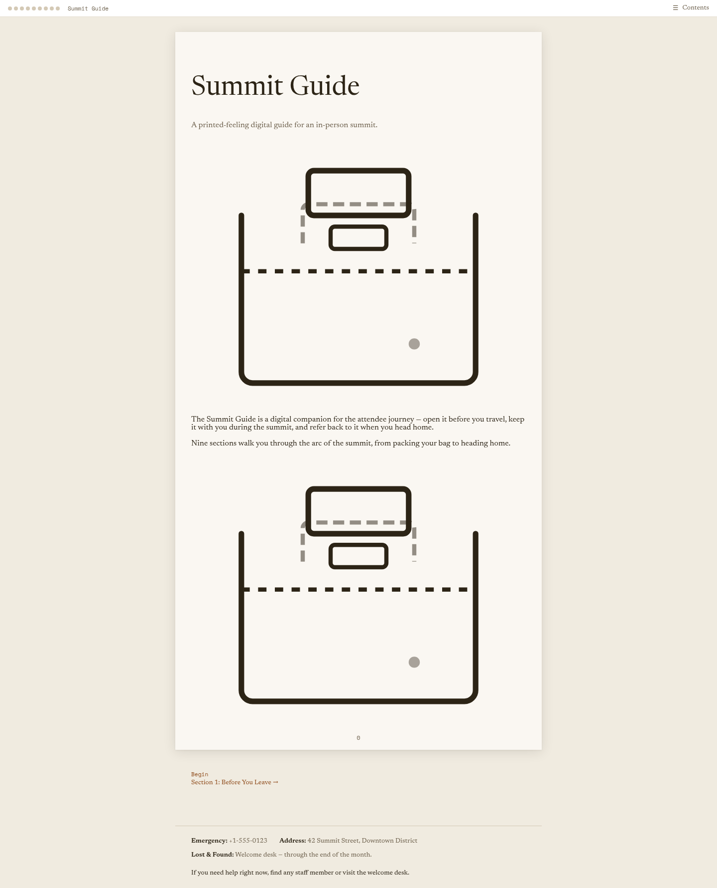
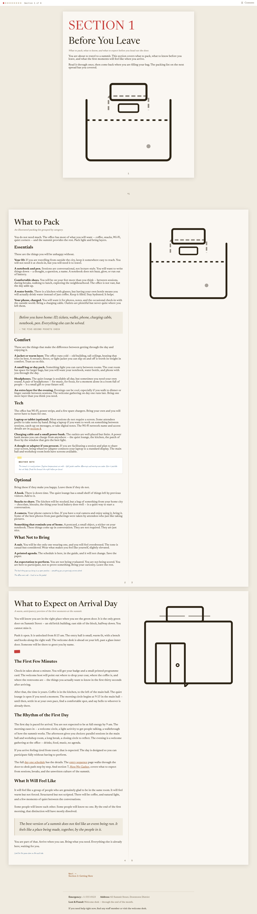
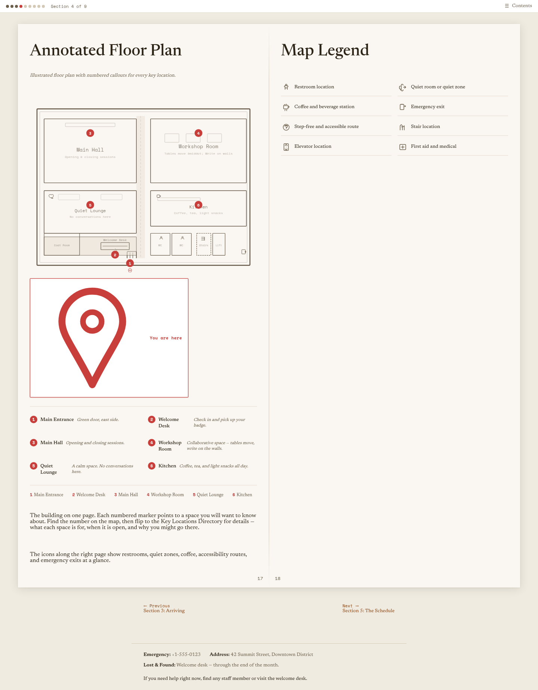
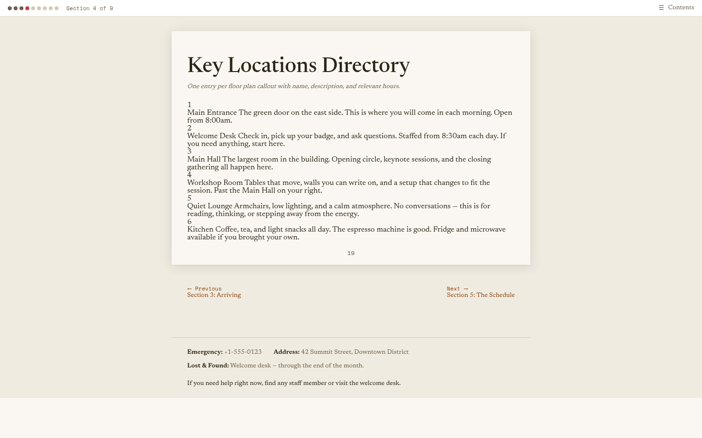
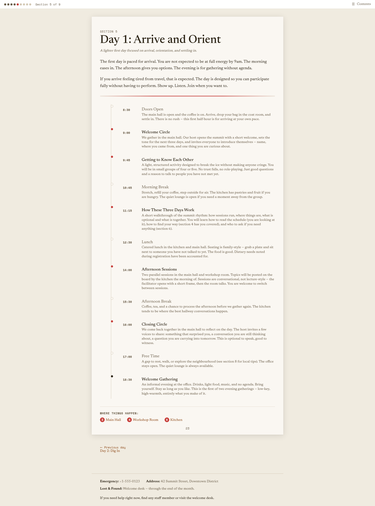
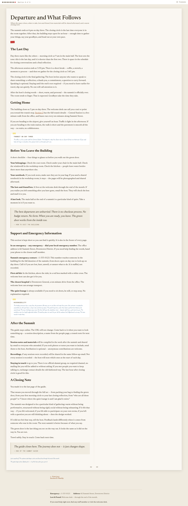

# Demo Script: Summit Guide Walkthrough

A narrated path through the journey arc for reviewer evaluation against `VISION.md`.

## Setup

Open the guide at the entry point (`/`) and follow the journey in sequence. Each section below highlights a spread or moment that proves the direction. Screenshots referenced inline are in `notes/vision/screenshots/`.

---

## 1. Entry Point — First Impression

The guide opens with a spot illustration and a spare, warm sentence: _"A printed-feeling digital guide for an in-person summit."_

**What to notice:** There is no hero banner, no countdown, no "Register Now" button. The page feels like opening a small booklet — a single-spread composition with breathing room. The suitcase illustration signals "travel" and "companion" before any text is read.

The page immediately communicates: this is not a website. This is a thing you received.

---

## 2. Section 1 — "Before You Leave" (Packing List)

The first section landing sets the pattern for all nine: a large section number in stamp colour, a title, a purpose sentence, and a spot illustration. The suitcase returns — the guide's visual vocabulary is consistent from page one.

Open _What to Pack_ (page 2–3). Notice:

- **Two-column layout** — information-dense but scannable
- **Marginalia** in the annotation font: _"The office runs cold — trust us on the jacket."_ — feels like a handwritten note from someone who has been there
- **Callout** — the five-second pockets check — an italic emphasis block with a left rule
- **Traveller's Note** — a sticky-note-style aside about weather, rendered as if tucked into the page
- **Voice** — warm, personal, instructional without being prescriptive: _"Pack light and bring layers."_

**Proof point:** A packing list could be a bullet-point table. Instead it is authored — each item has a reason, a personality, a small piece of advice that feels earned.

---

## 3. Section 2 — "Getting Here" (Map View)

The area map (`/getting-here/area-map/`) uses the `type: map` + `spread: map-view` content model. Numbered callouts point to real-feeling locations with short, personal descriptions.

**What to notice:**
- Maps are illustrated, not embedded from Google Maps — they feel drawn for this specific guide
- Callout descriptions are conversational ("Green door on the east side of the building")
- Icons and landmarks make the space feel knowable before arrival

The transit spread that follows (`/getting-here/transit-access/`) uses a two-column layout with icon references — bike, parking, accessibility, stairs, elevator — rendered as compact visual markers. The information is practical but the presentation is warm.

---

## 4. Section 4 — "Finding Your Way" (Annotated Floor Plan)

This is the most visually ambitious page type. The floor plan (`/finding-your-way/floor-plan/`) is an illustrated map with six numbered callouts and an icon legend. The companion directory page (`/finding-your-way/key-locations/`) cross-references each callout.

**What to notice:**
- The map is spatial and annotated — it teaches you the building rather than just showing it
- Icons along the right margin serve as a visual key — restrooms, quiet zones, coffee, accessibility routes, emergency exits
- The directory page is compact and scannable — one entry per callout with name, description, and hours
- The wayfinding spread that follows covers Wi‑Fi, restroom locations, quiet rooms, and emergency exits — all practical, all in voice

**Proof point:** A floor plan is the ultimate "event website does this as a PDF attachment" use case. Here it is a designed, integrated page that feels like it belongs in the guide.

---

## 5. Section 5 — "The Schedule" (Day View)

Each day is a `type: schedule-day` — a vertical timeline, not a grid. Day 1 (_Arrive and Orient_) shows the rhythm: doors open, welcome circle, icebreaker, morning break, orientation talk, lunch, afternoon sessions, closing circle, evening gathering.

**What to notice:**
- Sessions have time, title, icon, and a **narrative description** — not a one-line label
- The voice remains personal: _"No trust falls, no role-playing. Just good questions and a reason to talk to people you have not met yet."_
- The footer paragraph sets expectations warmly: _"If you arrive feeling tired from travel, that is expected. The day is designed so you can participate fully without having to perform."_
- Icons (coffee, talk, workshop, break, meal, social) provide visual rhythm without overwhelming

**Proof point:** A schedule is the most "corporate event website" artifact imaginable. This one reads like a daily itinerary in a travel guide — each session entry has a reason to exist, not just a time slot.

---

## 6. Section 6 — "People and Spaces"

The people page introduces four roles (Host, Welcome Host, Kitchen Keeper, Facilitators) in narrative prose — not bios, not headshots, not a directory grid. The callout on the page reads: _"You can ask anyone on the team for help. There is no wrong door."_

The spaces page describes each room by character — what it feels like, when it is open, what unwritten rules govern it. The quiet lounge entry, for example, explains not just where it is but that _"No explanation [is] required"_ to use it.

**Proof point:** People pages on event websites are headshot grids with titles. This one reads like someone introducing you to the team over coffee.

---

## 7. Section 7 — "How We Gather" (Rhythms and Rituals)

This section opens with: _"This is not a code of conduct. It is the unwritten culture, stated warmly."_ It explains how sessions work (conversations, not lectures), how breaks flow, what is expected (curiosity, not performance), and what is optional (everything).

Marginalia reinforce the tone: _"It is always okay to step out. No one is keeping score."_

---

## 8. Section 9 — "Before You Go" (Closing Page)

The final section is the shortest and carries the most emotional weight. Open the departure page (`/before-you-go/departure/`).

**What to notice:**
- The `` shortcode marks the transition from logistics to reflection
- Multiple component types work together: stamp, travellers-note, callout, marginalia
- The closing sentences land the emotional arc: _"The green door is the last thing you see on the way out. It looks the same as it did on the way in. You are not."_
- The final callout: _"The guide closes here. The journey does not — it just changes shape."_

**Proof point:** This is the moment that proves the concept. A logistics page on an event website ends with "Thank you to our sponsors." This one ends with a quiet, authored goodbye that makes you feel the summit mattered before you ever attended it.

---

## 9. Cross-Cutting Details

Throughout the walkthrough, notice the system-level decisions:

- **Page numbers** on every spread — the guide numbers itself like a book
- **Section navigation** — previous/next links at the bottom of each page
- **Table of Contents drawer** — always accessible, showing the full arc
- **Support footer** — emergency contact, venue address, help sentence on every page
- **Typography system** — two distinct typefaces (display and body) with a third (annotation) for marginalia and notes
- **Colour palette** — muted, paper-like, with stamp colours for emphasis
- **Icon vocabulary** — consistent, illustrated icons used across the guide
- **Page metaphors** — single-page, two-page-spread, map-view, directory-page, schedule-day — each with its own layout rules

---

## Walkthrough Summary

The journey arc takes a reviewer from "What is this?" to "I know where the green door is and I want to walk through it."

**Opening thought (entry point):** "This feels different. It feels authored."

**Middle thought (schedule, map, people):** "This is actually useful. I could navigate with this."

**Closing thought (departure page):** "This makes the summit feel intentional before I even arrive."

The demo succeeds if a reviewer finishes the walkthrough and thinks the two thoughts from `VISION.md`:

> "This feels like something I would want to open before I travel."
>
> "This makes the summit feel intentional before I even arrive."
